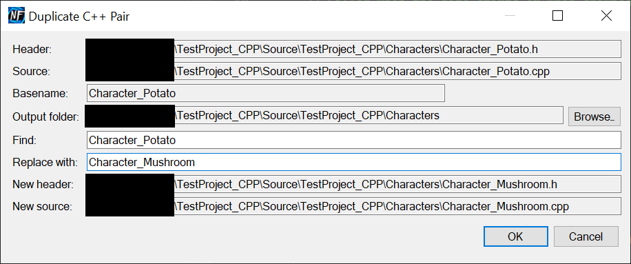

# NF_VSTools

Small, focused Visual Studio tools for C++ / Unreal Engine workflows by Neo Future Labs.

## ✨ Features

### Duplicate C++ file pair
Duplicate a `.h`/`.hpp` + `.cpp`/`.cc`/`.cxx` pair, rename inside files, and add them to your project.

- In **Solution Explorer**: right-click a header **or** source → **Duplicate C++ file pair as…**
- Dialog shows the detected header & source, lets you **Find / Replace** the base name, choose an **output folder**, and previews target paths.
- Guards against overwriting existing files.
- Preserves **file encoding (incl. BOM)** and **line endings** when writing.

### Logging
- See **Output → NF.VSTools** for diagnostics.

## ✅ Requirements
- Visual Studio **2022** (17.x)
- VSIX targets **.NET Framework 4.8**

> Other versions may work, but are untested.

## 📦 Install
- From Releases: download `NF.VSTools.vsix` and double-click to install.

## 🛠 Build from source
- Open `NF_VSTools.sln`, set the VSIX project as Startup, enable NuGet if not enabled, Build Solution, press **F5** or **Ctrl+F5** to launche the Experimental VS instance with or without debugging.

## 🚧 Roadmap / Known limits
- Pair detection works best when header/source share the same base name. Cross-folder layouts (e.g., `Private/.../Foo.cpp` ↔ `Public/.../Foo.h`) are being improved.

## 📜 License
This project is licensed under the **MIT License**. See [`LICENSE`](./LICENSE).

Third-party notices and licenses are listed in [`THIRD-PARTY-NOTICES.md`](./THIRD-PARTY-NOTICES.md).
